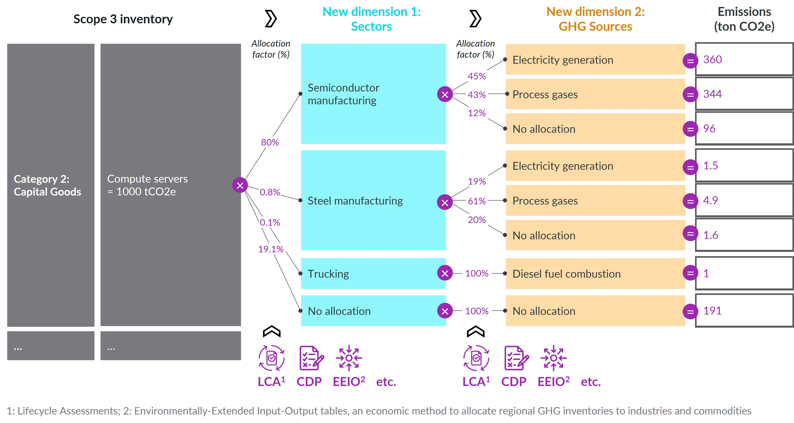
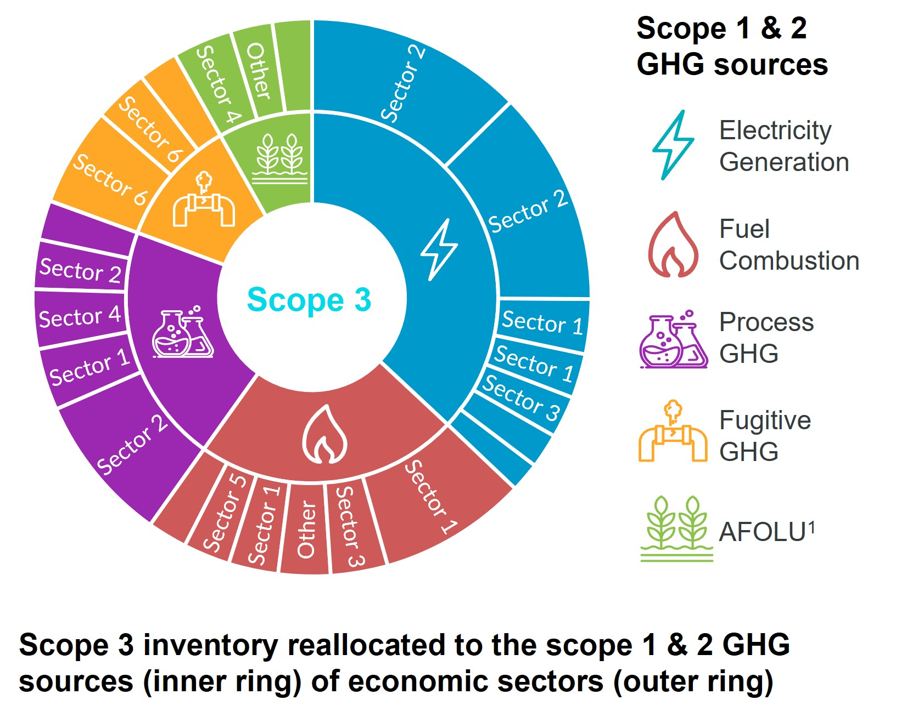

# USEEIO Disaggregation & Allocation Factors

This repository provides a simple, reproducible workflow to generate a tiered and scope-partitioned Supply Chain Emission Factors (SEF) table from USEEIO. It disaggregates each commodity’s total GHG intensity into:

- Tiers: Tier 1 (your organization's direct supplying sectors), Tier 2 (Tier 1's direct supplying sectors), Tier 3+ (all upstream)
- Scopes: Scope 1 and Scope 2

The main output is an Excel workbook and a CSV with absolute and relative contributions by embedded sector, tier, and scope.

## Just here for the data? (no coding required)

### Interactive visual

- Try the interactive sunburst built from the CSV in this repo: https://damienlieber-dnexus.github.io/useeio_sectors_disaggregation/
  - Note: On first setup, GitHub Pages can take 1–2 minutes after a push to publish. If you see a 404 ("There isn't a GitHub Pages site here."), wait a minute and refresh.
- It lets you pick a commodity and explores Scope (1/2) → Tier (1/2/3+) → Sector codes as a sunburst using Relative_Contribution values.

### Data tables

- Go to the `outputs/` folder and download the latest files:
  - Excel: `outputs/SEF_<version>_disaggregation_factors_GHG<year>_IO<year>.xlsx`
  - CSV:   `outputs/SEF_<version>_disaggregation_factors_GHG<year>_IO<year>.csv`
- Open in Excel or your favorite spreadsheet tool.
- Start with the "Contributions_by_Name" tab if you prefer industry names over codes.

What’s inside (high level):
- Contributions by Tier and Scope show how much each upstream sector contributes to the chosen commodity’s GHG intensity.
- “Absolute contribution” columns are intensities (kgCO2e per USD of the embedded commodity, in the specified IO year).
- “Relative contribution” shows the percentage split across all contributing sectors for a given commodity (sums to 100%).
- The "sector_classification" tab provides category, subcategory, and descriptions to understand each sector.

### Use

For context on how these contributions help translate Scope 3 inventories into actionable drivers, see the AIM Platform's article "What Is Deep Value Chain Analysis, and How Can It Scale Corporate Decarbonization Investments?": https://aimplatform.org/what-is-deep-value-chain-analysis-and-how-can-it-scale-corporate-decarbonization-investments/. This dataset helps you:
- Identify hotspots by sector and upstream tier
- Separate Scope 1 vs Scope 2 contributions for better prioritization
- Connect your organization's demand and supply within the economy to specific GHG sources
- Conduct hybrid EEIO accounting under the GHG Protocol (see Example 1.3): https://ghgprotocol.org/sites/default/files/2023-03/Scope3_Calculation_Guidance_0%5B1%5D.pdf. Learn more at https://tasaanalytics.com/hybrid-path-methodology/

## Quick start (to reproduce the data)

1) Install R (≥ 4.2) and RTools (Windows). Optional but recommended: RStudio.
2) Clone or download this repository.
3) Edit `config.yml` (see below) if you want to change the SEF version or Scope 2 sectors.
4) Render the analysis from R/RStudio:
   ```r
   rmarkdown::render("analysis/generate_scope3_disaggregation_table_tier1_2_3+.Rmd")
   ```

   Or click the "Knit" button when viewing the Rmd in RStudio.

Artifacts will be saved under `outputs/` and are committed to the repo so non-technical users can download them directly.

## Requirements

This workflow installs packages on first run. At minimum, you’ll need:

- Internet access (to install packages and download model specs)
- R packages: pacman, yaml, dplyr, reshape2, knitr, httr, openxlsx, stringr, tidyr, devtools, useeior

The R Markdown takes care of installing `devtools`/`useeior` versions that match your selected SEF version.

## Configuration (`config.yml`)

Example in `config.yml`:

```yaml
sef_version: "v1.3.0"

# List of sectors considered as Scope 2 (utilities), using USEEIO codes
scope_2_sectors:
  - "221100/US"
```

- `sef_version`: Supply Chain Emission Factors (SEF) release to reproduce. The script will automatically fetch the matching USEEIO model/spec and correct `useeior` package version.
- `scope_2_sectors`: Sectors whose direct emissions you want treated as Scope 2. You can add more codes as needed.

## Project structure

- `analysis/generate_scope3_disaggregation_table_tier1_2_3+.Rmd` – Main analysis; builds model, runs decomposition, and exports outputs
- `config.yml` – User configuration (version and Scope 2 sectors). Edit this.
- `spec_files/` – USEEIO model spec files (downloaded or stored)
- `scripts/render.R` – One-click render helper
- `outputs/` – Rendered outputs (Excel/CSV) ready for end users
- `local/` – Your scratch area; ignored by Git

## How to use the outputs (practical guide)

1) Open the Excel file in `outputs/`.
2) Go to the "Contributions_by_Name" tab (easier for beginners) or "Contributions_by_Code" if you work with codes.
3) Find your commodity (the product or service you spend on) in the Disaggregated_Commodity columns.
4) Use "Relative_Contribution" to disaggregate your total emissions: multiply your commodity's total emissions by the "Relative_Contribution" values to identify and surface the largest upstream drivers.
5) Use the "Tier" field to see whether impacts are direct (Tier 1), from immediate suppliers (Tier 2), or further upstream (Tier 3+).
6) Use the "Scope" field to distinguish Scope 1 vs Scope 2 drivers.
7) For deeper context on what a sector represents and how it is classified, check the "sector_classification" tab.

Additional reading and context:
- Deep Value Chain Analysis and scaling corporate decarbonization investments (AIM Platform): https://aimplatform.org/what-is-deep-value-chain-analysis-and-how-can-it-scale-corporate-decarbonization-investments/
- AIM Platform Association Test (draft guidance): https://aimplatform.org/standard-development/aim-platform-association-test/
- Hybrid EEIO accounting under the GHG Protocol (see Example 1.3): https://ghgprotocol.org/sites/default/files/2023-03/Scope3_Calculation_Guidance_0%5B1%5D.pdf
- Hybrid Path Methodology by Tasa Analytics: https://tasaanalytics.com/hybrid-path-methodology/

## Limitations & planned development
1) Margins are not disaggregated yet - the current datasets only apply to emission factors without margins. Make sure to only disaggregate the "SEF" portion of your emissions / emission factors. Future versions may add the disaggregation of margins.
2) The limitations of EEIO models are well documented in e.g., Ingwersen, Wesley, Mo Li, Ben Young, Jorge Vendries, and Catherine Birney. 2022. “USEEIO V2.0, the US Environmentally-Extended Input-Output Model V2.0 (USEEIOv2.0).” Scientific Data 9: 194. https://www.nature.com/articles/s41597-022-01293-7
3) This project's categorization of Scope 1 and Scope 2 emissions includes known differences compared to standard corporate GHG accounting protocols. For example, in corporate GHG accounting, emissions from leased assets (like real estate) are often accounted for as the lessee's (tenant's) Scope 1 and 2 emissions. In this project, these emissions are attributed to the real estate sector itself (i.e., the lessor's sector). A future version will provide an option to reallocate these emissions from the asset's sector to the scope 1 and 2 of purchasers. Another example is that Scope 2 calculation currently includes all direct emissions from the electricity sector (generation, transmission, and distribution). It does not isolate only the generation emissions associated with the electricity consumed by the end-user. This methodology may cause Scope 2 estimates to be a few percent higher than they would be under standard accounting rules. Future versions will introduce options to isolate electricity generation emissions from transmission and distribution (T&D) emissions, and estimate T&D losses using a specific factor.

## Beginner setup: getting R running (no prior coding experience)

Windows (recommended simplest path):
1) Install R: https://cran.r-project.org/bin/windows/base/
2) Install RTools (compile support): https://cran.r-project.org/bin/windows/Rtools/
3) Install RStudio (optional but easier): https://posit.co/download/rstudio-desktop/
4) Download/clone this repository and open it in RStudio (double-click the `.Rproj` file or use File > Open Project).
5) In the RStudio, open `analysis/generate_scope3_disaggregation_table_tier1_2_3+.Rmd` and click "Knit" (or run the render line above). The process will install any missing packages and produce the Excel/CSV in `outputs/`.

Note: If CMD cannot find Rscript, open RStudio and run `source("scripts/render.R")` instead.

macOS:
1) Install R: https://cran.r-project.org/bin/macosx/
2) (Optional) Install Xcode Command Line Tools if prompted.
3) Install RStudio: https://posit.co/download/rstudio-desktop/
4) Open the project in RStudio and click "Knit" in `analysis/generate_scope3_disaggregation_table_tier1_2_3+.Rmd` (or run the render line above).

If you don’t want to install anything, you can still download the pre-built files directly from the `outputs/` folder on GitHub.

## Troubleshooting

- If you encounter issues with Rscript or PATH: open RStudio and click "Knit" on the analysis Rmd.
- Network/timeout errors when downloading specs: check connectivity or proxy settings, then re-run.
- Package install issues: try `install.packages("pacman")` in R, then rerun the render.

## Feedback, questions, and feature requests

We’re learning with you. Please use the repository’s Discussions tab to ask questions, request features, or share how you’re using the data.

## License

See `LICENSE`.

## Credits and acknowledgement

Huge thanks to the USEPA and Cornerstone teams and contributors whose work powers this project:
- USEEIO package and models: https://github.com/USEPA/useeior/
- Supply Chain Emission Factors: https://github.com/USEPA/supply-chain-factors
- FLOWSA: https://github.com/USEPA/flowsa

Project by Damien Lieber @ [DecarbNexus LLC](https://decarbnexus.com).

## Pair this with GHG source disaggregation

This project focuses on disaggregating Scope 3 emissions by USEEIO sectors (and tiers). You’ll soon be able to combine it with a companion workflow that disaggregates each sector’s emissions into their underlying greenhouse gas sources:

- Upcoming repository: https://github.com/damienlieber-dnexus/useeio_ghg_sources_disaggregation (target publication by Thanksgiving 2025)
- Data foundation: It leverages USEPA’s FLOWSA (https://github.com/USEPA/flowsa), which is also a core data source for USEEIO. Pairing the two lets you go from “which sectors and tiers?” to “which GHG sources within those sectors?”

GHG source disaggregation completes the DecarbNexus primary disaggregation workflow using USEEIO data, as illustrated below.


When used together, you can produce visuals like the sunburst below, which organize Scope 3 in the intuitive language of Scope 1 & 2 - by sector and source.
<p>
  
  
</p>
